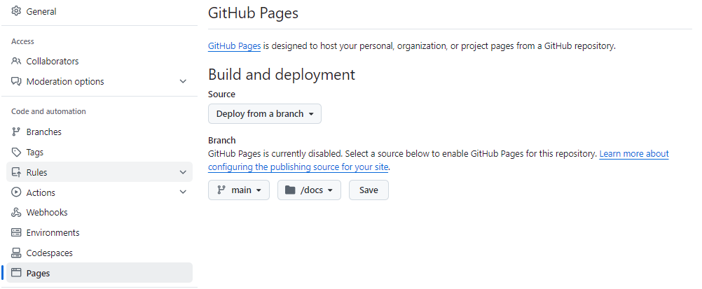

# bioschemas-ghpages-markup-tutorial

## Overview
* __Name:__ Tutorial on adding Bioschemas markup to GitHub pages
* __Description:__ This tutorial shows how to add Bioschemas markup to GitHub pages. It uses a simple GitHub page hosted in the gh-pages branch to create a sample project page, i.e., as learners could do with their own GitHub projects. As an example, it uses the software and data corresponding to the released project [TREC-doc-2-doc-relevance](https://github.com/zbmed-semtec/TREC-doc-2-doc-relevance), a web-based interface to add document-to-document relevance assessments to pairs of documents retrieved from [TREC 2005 Genomics Track](https://trec.nist.gov/data/genomics/05/genomics.qrels.large.txt). 
* __Keywords:__ Bioschemas, schema.org, structured markup, GitHub pages

__Questions__
* How can I add Bioschemas markup to GitHub pages?
* Can I also use schema.org types not included in Bioschemas?
* How can I use Bioschemas profiles? In particular [ComputationalTool](https://bioschemas.org/profiles/ComputationalTool/1.0-RELEASE) and [Dataset](https://bioschemas.org/profiles/Dataset/1.1-DRAFT) (bonus, we also use [TrainingMaterial](https://bioschemas.org/profiles/TrainingMaterial/1.0-RELEASE) to describe the tutorial itself)

__Learning outcomes__
* Describe how schema.org and Bioschemas markup can be embedded to GitHub pages
* Use schema.org and Bioschemas profiles on GitHub pages
* Use schema and Bioschemas validators

__Requirements__
* Familiarity on how to use GitHub 
* Basic knowledge on how to use GitHub pages. More information at [GitHub Pages](https://pages.github.com/)
* Familiarity with JSON-LD
* Basic knowledge on Markdown

__Time estimation__ 30 minutes

__Level__ Beginner / Introductory

__Published__ 2024-02-05

__Latest modification__ 2024-02-05

__License__ [CC-By 4.0](https://spdx.org/licenses/CC-BY-4.0)

__Identifier__ 

__Citation__ 

## Learning experience

### Agenda
In this tutorial we will cover:
* [Creating this GitHub page](#creating-this-github-page)
* [Adding schema.org and Bioschemas markup](#adding-schemaorg-and-bioschemas-markup)
* [Visualizing the structured markup](#visualizing-the-structured-markup)
* [Validating the pages against the schema Validator](#validating-the-pages-against-the-schema-validator)
* [Validating the pages against FAIR-Checker/Bioschemas validator](#validating-the-pages-against-fair-checkerbioschemas-validator)

### Creating this GitHub Page
* Fork this repository for your own purposes
* Go to settings

* Enable "Pages" on your forked repository, select "Deploy from a branch" using the branch "gh-pages" 
* Save the changes. As this repo does have a gh-pages branch, it will use it. If such branch would not exist, GitHub would ask you to use the main branch to start the gh-pages one

* In a matter of minutes, your site will be live. 

* Get a local copy of your fork

### Adding schema.org and Bioschemas markup
We have already add schema.org and Bioschemas markup corresponding to our example, code and data for our repo [TREC-doc-2-doc-relevance](https://github.com/zbmed-semtec/TREC-doc-2-doc-relevance).

Have a look to the pages that we have created, one for the code and corresponding release, another for data. 

### Visualizing the structured markup

### Validating the pages against the schema Validator

### Validating the pages against FAIR-Checker/Bioschemas validator